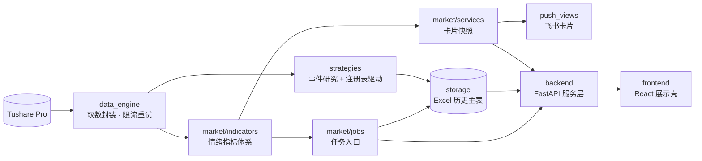

<div align="center">


# Kaka Quant

**面向 A 股研究工作流的轻量个人量化工作台**

*A lightweight personal quant workbench for A-share research workflows*

[](https://github.com/Conquerer-yinn/Kakaaaa-quant/actions/workflows/backend-tests.yml)
[](https://github.com/Conquerer-yinn/Kakaaaa-quant/actions/workflows/frontend-build.yml)
[](https://github.com/Conquerer-yinn/Kakaaaa-quant/tags)
[](https://www.python.org/)
[](LICENSE)
[](https://github.com/astral-sh/ruff)

盘后复盘 → 情绪指标 → 历史主表 → 消息推送 → 网页展示 → 策略验证

</div>

---

## ✨ 它解决什么问题

多数量化框架为"跑策略"而生，Kaka Quant 为"做研究"而生。它不是重型量化平台，
而是把一个 A 股研究者每天真实要做的事串成一条自动化闭环：

| | 能力 | 说明 |
|---|---|---|
| 📊 | **市场情绪指标体系** | 涨跌停 / 炸板 / 大回撤 / 连板高度 / 创业板专区 / 涨停股次日反馈 / 位置度量 |
| 🗂 | **Excel 历史主表** | 增量补数、区间命名、滚动改名、写前自动备份、表格区域自动维护 |
| 📮 | **三类飞书卡片** | 盘后复盘 / 竞价观察 / 盘中节奏，一键预览、刷新、推送到群 |
| 🧬 | **策略事件研究** | 创业板涨停后 1/3/5 日事件研究：基准超额收益、首板/连板与市场环境分组、样本质量表 |
| ⚡ | **FastAPI 服务层** | 任务注册表、后台任务、状态轮询与协作式取消 |
| 🖥 | **React 展示前端** | 历史数据图表联动、卡片管理、策略研究复盘页 |
| 🎯 | **策略研究主线** | 注册表驱动：研究 → 登记 → 试运行 → 启用 → Excel 复盘 |
| 🧪 | **工程化保障** | 96 项自动化测试 · Ruff · GitHub Actions · Docker Compose |

## 🏗 架构

三层结构，单向依赖——卡片和前端直接吃原始数据与指标结果，从不反向依赖 Excel 视图：



<details>
<summary><b>目录结构</b></summary>

```text
Kaka_Quant/
├── backend/            # FastAPI 轻量服务层：任务、读取、卡片、策略接口
├── common/             # 配置（全部走环境变量）与飞书通知器
├── data_engine/        # Tushare 封装：日历 / 行情 / 涨跌停 / 竞价 / 实时
├── frontend/           # React + Vite 展示前端
├── market/
│   ├── indicators/     # 可复用情绪指标（口径文档就近维护）
│   ├── jobs/           # 可独立运行的任务入口
│   ├── services/       # 三类卡片快照构建
│   └── push_views/     # 飞书卡片视图
├── storage/            # Excel 主表 / 备份 / 表格区域维护
├── strategies/         # 事件研究 + 策略脚本 + 研究笔记 + 注册表
├── tests/              # 90 项 Python 自动化测试
└── docs/               # 架构 / 安全 / 运行手册 / 研究设计
```

</details>

## 🚀 快速开始

```bash
git clone https://github.com/Conquerer-yinn/Kakaaaa-quant.git && cd Kakaaaa-quant
pip install -r requirements.txt
cp .env.example .env        # 填入 TUSHARE_TOKEN 与 FEISHU_BOT_WEBHOOK
```

```bash
# 后端（http://127.0.0.1:8000/docs 查看全部接口）
uvicorn backend.main:app --reload

# 前端（另开终端，http://127.0.0.1:5173）
cd frontend && npm ci && npm run dev
```

```bash
# 跑一个真实任务：增量更新市场情绪历史主表
python market/jobs/run_market_sentiment.py

# 盘后飞书卡片先 dry-run 预览，再去掉参数真实推送
python market/jobs/push_post_close_card.py --dry-run

# 运行创业板涨停事件研究（最近 120 天）
python strategies/run_chinext_limit_up_event_study.py
```

<details>
<summary><b>Docker 一键启动</b></summary>

```bash
docker compose up --build
# backend: http://127.0.0.1:8000   frontend: http://127.0.0.1:5173
```

</details>

更完整的操作清单见 **[运行手册](docs/RUNBOOK.md)**。

## 📮 三类飞书卡片

| 卡片 | 触发时点 | 内容 | 状态 |
|---|---|---|---|
| 盘后复盘 | 收盘后 | 量能、涨跌停、炸板、连板高度、创业板反馈、规则化情绪结论与风险提示 | ✅ 稳定 |
| 竞价观察 | 9:25 后 | 指数开盘强弱、竞价成交额、竞价涨跌停与前排个股 | ✅ 第一版 |
| 盘中节奏 | 盘中任意 | 实时指数、全天成交额外推、时段节奏；实时权限不足自动降级为日线 | 🧪 实验性 |

三类卡片均支持从前端推送页或 API（`/market/push/{card_type}/refresh|send`）预览、刷新与发送。

## 🧬 策略事件研究

第一条真实研究闭环：**创业板涨停后 5 日事件研究（V2）**。

- 识别创业板涨停事件，只统计未来 5 个交易日行情完整的样本，排除 ST 与上市未满 60 天个股
- 计算事件后第 1、3、5 日原始收益及相对 `399006.SZ` 的超额收益
- 按首板/连板及弱/中/强市场环境分组统计，样本质量表显式计数所有排除项
- 输出五 Sheet Excel（摘要/分组/质量/明细/运行信息），API 与 `/strategies` 页面直读

研究口径与边界详见 [strategies/README.md](strategies/README.md)。

## 🧪 质量保障

- **96 项自动化测试**（90 Python + 6 前端）：指标口径、Excel 读写与去重、事件研究口径、
  基准与分组统计、卡片结构、任务生命周期、API 集成、凭据安全扫描
- **CI**：每次 push / PR 自动跑后端测试（含 Ruff 语法闸门）与前端构建校验
- **安全**：凭据只走环境变量，仓库零明文密钥，自定义网关强制 HTTPS，详见 [安全说明](docs/SECURITY.md)

```bash
pytest && ruff check . && (cd frontend && npm test)
```

## 🗺 路线图

- [x] v1.0.0 —— 情绪指标体系 · 历史主表 · 三类卡片 · 前后端闭环 · 策略主线 · 测试与 CI
- [x] 首个事件研究闭环 —— 创业板涨停 1/3/5 日 · 基准超额 · 首板/连板与市场环境分组 · 样本质量表
- [ ] 更多旧指标迁移到 `market/indicators/`
- [ ] 事件研究扩展到更多板块与观察窗口
- [ ] 盘中卡片实时链路稳定性提升
- [ ] 在单任务流程稳定后，评估数据库层与更通用的任务调度

完整设计取舍见 [DEVELOPMENT_PLAN.md](DEVELOPMENT_PLAN.md) 与 [docs/ARCHITECTURE.md](docs/ARCHITECTURE.md)。

## 🤝 贡献与协作

这是一个以真实使用驱动的个人项目，Issue / PR 欢迎，但节奏以研究需求优先。
项目的长期协作机制（决策记录、状态快照、对话归档）沉淀在 [`project_memory/`](project_memory/)，
接手前建议先读 [AI_HANDOFF](project_memory/handoff/AI_HANDOFF.md)。

## ⚠️ 免责声明

本项目仅用于技术研究与个人复盘，不构成任何投资建议。
事件研究结果不包含交易成本与执行摩擦，不代表可复制收益。市场有风险，据此操作产生的一切后果自负。

## 📄 License

[MIT](LICENSE) © 2025 Conquerer-yinn
