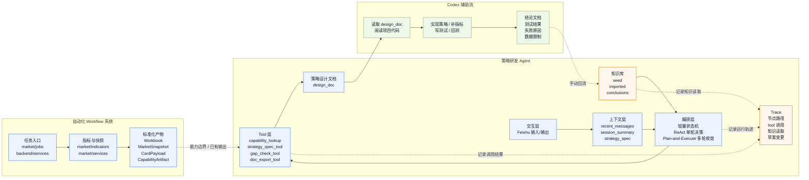
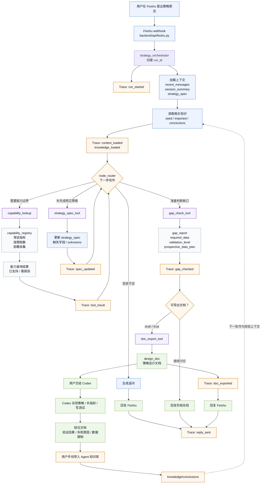
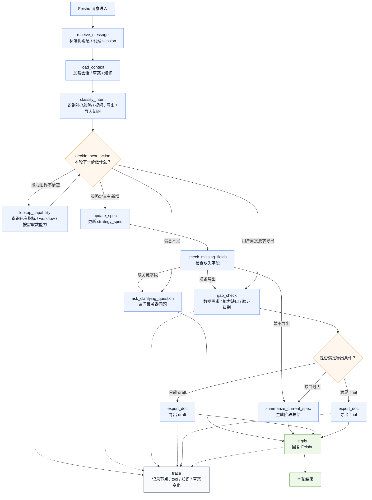

# DEV_SPEC：Kaka_Agent_Quant 1.0 开发规格书

## 目录

- [1. 文档信息](#1-文档信息)
- [2. 执行摘要](#2-执行摘要)
- [3. 总体架构设计](#3-总体架构设计)
- [4. 仓库目标目录结构](#4-仓库目标目录结构)
- [5. 自动化 Workflow 系统设计](#5-自动化-workflow-系统设计)
  - [5.1 设计目标](#51-设计目标)
  - [5.2 当前已存在的 workflow 主线](#52-当前已存在的-workflow-主线)
  - [5.3 workflow 侧需要标准化的内容](#53-workflow-侧需要标准化的内容)
  - [5.4 workflow 需要为策略研发 Agent 提供的数据支持](#54-workflow-需要为策略研发-Agent-提供的数据支持)
  - [5.5 workflow 侧标准化目标](#55-workflow-侧标准化目标)
  - [5.6 1.0 必做改造](#56-10-必做改造)
  - [5.7 workflow 验收条件](#57-workflow-验收条件)
- [6. Agent 设计](#6-agent-设计)
  - [6.1 Agent 定位与边界](#61-agent-定位与边界)
  - [6.2 Agent 输入与输出](#62-agent-输入与输出)
  - [6.3 Agent 内部结构](#63-agent-内部结构)
  - [6.4 Agent 核心工作对象](#64-agent-核心工作对象)
  - [6.5 Tool 设计](#65-tool-设计)
  - [6.6 编排与决策机制](#66-编排与决策机制)
  - [6.7 知识库设计](#67-知识库设计)
  - [6.8 Agent 与 Codex 协作设计](#68-agent-与-codex-协作设计)
  - [6.9 Agent Trace 设计](#69-agent-trace-设计)
- [7. 项目排期与阶段任务](#7-项目排期与阶段任务)
  - [7.1 阶段总览](#71-阶段总览)
  - [7.2 阶段 0：规格冻结](#72-阶段-0规格冻结)
  - [7.3 阶段 1：workflow 能力边界](#73-阶段-1workflow-能力边界)
  - [7.4 阶段 2：Agent 核心对象与工具](#74-阶段-2agent-核心对象与工具)
  - [7.5 阶段 3：Agent 编排与 Feishu 闭环](#75-阶段-3agent-编排与-feishu-闭环)
  - [7.6 阶段 4：gap、数据需求与前瞻建议](#76-阶段-4gap数据需求与前瞻建议)
  - [7.7 阶段 5：知识库与 trace](#77-阶段-5知识库与-trace)
  - [7.8 阶段 6：端到端验收](#78-阶段-6端到端验收)
- [8. 测试计划](#8-测试计划)
- [9. 验收标准](#9-验收标准)
- [10. 后续升级路径](#10-后续升级路径)

---

## 1. 文档信息

- 文档名称：`DEV_SPEC`
- 产品：`Kaka_Agent_Quant 1.0`
- 所属仓库：`Kaka_Quant`
- 版本：`1.0`
- 日期：`2026-04-24`
- 状态：`Working Draft`
- 读者：
  - 你自己，用于 review 产品边界、架构和开发路径
  - Codex / AI 开发代理，用于按规格书实施开发

本文件是本项目当前阶段的**主开发规格书**。

它不是：

- 对外文档
- PRD
- 脑暴记录
- 随意讨论稿

它是：

- 你后续 review 设计的主文档
- Codex 后续实施开发的主依据
- 后续测试、验收、继续拆分多 Agent 的基线文档

这份文档要回答 6 个问题：

1. `Kaka_Agent_Quant 1.0` 到底是什么产品，解决什么问题
2. 为什么要拆成自动化 workflow 和策略研发 Agent 两条主线
3. 当前仓库已经有什么，1.0 版本在现有基础上补什么
4. 策略研发 Agent 到底怎么工作
5. 系统如何保证可靠、可控、可积累
6. 这个 1.0 版本应该如何分阶段实现、测试与验收

### 1.1 文档使用原则

后续如果把这份文档交给 Codex 直接开发，需要遵守下面几条：

1. 文档中凡是写成“必须”“应当”“1.0 只做”的内容，默认视为实现约束。
2. 文档中凡是写成“可选”“后续再做”“2.0 再考虑”的内容，默认不进入 1.0 第一轮实现。
3. 如果某个设计细节仍未定稿，必须显式写出来，不能让开发代理自行脑补。
4. 如果某个能力当前仓库里已经存在，后续实现默认优先复用，而不是重写。
5. 这份文档的目标不是列举所有可能性，而是把 **1.0 真正要实现的内容写到足够细**。

### 1.2 精细化要求

这份文档后续需要持续往“可直接开发”的方向推进。

也就是说，后面的每一块内容最终都应尽量落到以下层级：

- 模块职责
- 输入 / 输出
- 状态变化
- tool 调用边界
- 文件归属
- 测试点
- 验收标准

如果某一节还停留在“概念说明”层面，就说明那一节还没有写到位，后续需要继续细化。

---

## 2. 执行摘要

### 2.1 产品定义

`Kaka_Agent_Quant 1.0` 是一个构建在现有 `Kaka_Quant` 仓库之上的、面向 A 股短线策略研发的单 Agent 产品。

它不是：

- 全自动交易系统
- 从零开始的新平台
- 通用金融问答机器人
- 一上来就做完整多 Agent 的重系统

它是：

- 一个以现有自动化 workflow 为底座的研究型产品
- 一个以“策略设计文档”为核心交付物的策略研发 Agent
- 一个通过 `Agent -> Codex -> 结论回流` 形成研发闭环的 1.0 版本

这个 1.0 值得做的原因是：

- 当前仓库已经有较清晰的研究 workflow 底座
- 真正缺少的是“把模糊策略想法稳定收敛成可开发文档”的能力
- 先把策略研发闭环做通，比一开始追求完整自动交易或重型多 Agent 更可落地

### 2.2 当前项目基础

当前 `Kaka_Quant` 仓库已经具备一条较清晰的自动化 workflow 主线，核心围绕 `market/` 展开，主要能力包括：

- 通过 Tushare 获取研究数据
- 计算已有市场指标
- 维护历史主表和工作簿
- 生成市场快照
- 输出飞书卡片和接口结果

当前已落地的代表性 workflow 包括：

- `daily-basics`
- `market-sentiment` 历史主表增量更新流程
- 盘后、竞价、盘中三类飞书卡片流程
- backend 的任务触发、后台执行与推送封装

这意味着：

- 当前项目**不缺一个会跑任务的系统**
- 当前项目**缺的是围绕策略研发持续工作的 Agent 层**

同时需要明确：

- workflow 主线已经相对清楚
- `strategies/` 这条主线仍处于较前期阶段
- 因此 `Kaka_Agent_Quant 1.0` 的核心新增价值应当放在“策略研发 Agent”上，而不是重做整个 workflow

### 2.3 1.0 的两条主线

`Kaka_Agent_Quant 1.0` 明确分成两条主线：

#### A. 自动化 workflow 系统

定位：`底座`

负责：

- 数据更新
- 指标执行
- 工作簿维护
- 市场快照与固定研究输出
- 必要数据卡片推送
- 后续成熟策略的自动化输出

目标：

- 把已有研究流水线标准化、可复用、可定时运行
- 对 Agent 暴露清晰的能力边界

#### B. 策略研发 Agent

定位：`1.0 的核心新增能力`

负责：

- 在 Feishu 中与你多轮讨论策略
- 收敛策略定义
- 维护结构化策略草案
- 判断当前项目已有能力能支持到哪一步
- 导出可交给 Codex 的策略设计文档

目标：

- 把模糊的短线策略想法稳定地变成可开发、可测试的设计文档

### 2.4 核心研发闭环

`Kaka_Agent_Quant 1.0` 的核心闭环如下：

1. 用户在 Feishu 中提出一个策略想法
2. 策略研发 Agent 基于会话状态、当前策略草案和项目已有能力边界进行多轮讨论
3. Agent 逐步补齐策略定义，并导出策略设计文档
4. 用户把设计文档交给 Codex
5. Codex 基于文档和当前仓库代码实现策略、补指标、编写回测或测试逻辑
6. Codex 输出实现与测试结论文档
7. 结论文档回流到 Agent 的知识层，供后续类似策略研发继续复用

这个闭环的关键点是：

- Agent 不直接写代码
- Codex 不负责定义策略方向
- 两者通过“策略设计文档”和“测试结论文档”协作

### 2.5 知识积累机制（暂存）

这一部分当前只在执行摘要中保留一个简要占位，详细设计应放到后面的专门章节中展开。

当前结论是：

- `Kaka_Agent_Quant 1.0` 必须预留一层轻量的策略研发知识库
- 该知识库至少支持三类知识来源：
  - 初始短线知识
  - 外部导入知识
  - Codex 的实现与测试结论
- 该知识库当前的作用不是通用问答，而是为策略研发讨论提供经验上下文
- 1.0 阶段先做轻量知识库，不直接上完整 RAG 或更重方案

### 2.6 1.0 版本边界

`Kaka_Agent_Quant 1.0` 的目标不是“做一个什么都能干的超级 Agent”，而是先把最关键的闭环打通：

`自动化 workflow 底座 + 策略研发 Agent + Codex 实现测试协作 + 知识回流沉淀`

#### 2.6.1 服务边界

1.0 版本只服务你自己，面向的是你当前真实的 A 股短线策略研发工作流，而不是：

- 多用户平台
- 通用金融助手
- 完整量化交易平台

#### 2.6.2 协作边界

在 1.0 中：

- Agent 负责讨论、收敛、导出文档
- Codex 负责实现、补指标、测试、回测、输出结论
- 用户负责在 Agent 与 Codex 之间完成交接和审阅

#### 2.6.3 知识边界

1.0 需要轻量知识库，但：

- 不做完整 RAG
- 不做复杂知识平台
- 不做通用知识搜索系统

当前知识层只服务于策略研发讨论本身。

#### 2.6.4 非目标

1.0 明确不做：

- 全自动交易
- 自动修改仓库代码
- 自动运行任意复杂回测
- 自动决定策略是否真实赚钱
- 自动把策略升级成正式运行策略
- 完整多 Agent 编排
- 完整知识 RAG 平台

#### 2.6.5 当前版本重点

1.0 的重点只有两个：

1. 把当前 workflow 主线整理成可标准化、可查询、可复用的能力底座
2. 把策略研发 Agent 做成一个真正可用、可控、可积累的单 Agent 产品

---

## 3. 总体架构设计

本章说明 `Kaka_Agent_Quant 1.0` 的整体系统组织方式。

本章只描述两件事：

1. 系统由哪些角色组成
2. 数据、文档、知识和 trace 如何流转

本章不展开具体 tool 参数、schema 字段、节点代码和文件级接口签名。这些内容在第 4、5、6、7、8、9 章详细定义。

### 3.1 系统总体架构设计

`Kaka_Agent_Quant 1.0` 由三个角色组成：

| 角色 | 系统定位 | 主要产物 |
|---|---|---|
| `自动化 Workflow 系统` | 确定性数据与指标底座 | `Workbook`、`MarketSnapshot`、`CardPayload`、`CapabilityArtifact` |
| `策略研发 Agent` | 1.0 的核心新增能力，负责策略讨论、收敛和文档导出 | `strategy_spec`、`gap_report`、`design_doc`、`trace` |
| `Codex 辅助流` | 辅助实现与测试，不属于运行时主系统 | 策略实现、补充指标、测试结果、结论文档 |

三者关系：

- Workflow 系统不依赖 Agent 才能运行。
- 策略研发 Agent 通过受限工具读取 workflow 的能力边界。
- Codex 读取 Agent 导出的 `design_doc`，再结合项目代码完成实现与测试。
- Codex 的结论文档可以由用户手动导入 Agent 知识库，作为后续策略讨论的经验上下文。
- Trace 是 Agent 内部的可观测性侧链，不参与策略决策，但必须记录运行路径和关键事件。



### 3.1.1 自动化 Workflow 系统

职责：

- 通过 `market/jobs` 和 `backend/services` 执行确定性任务。
- 调用 `market/indicators`、`market/services` 计算已有指标和市场快照。
- 维护工作簿、市场快照、飞书卡片 payload 等标准化产物。
- 对策略研发 Agent 暴露能力边界，而不是把所有原始数据直接交给 Agent。
- 后续成熟策略可以进入 workflow，成为固定输出或自动化监控内容。

主要代码落点：

- `market/jobs/`
- `market/indicators/`
- `market/services/`
- `data_engine/`
- `storage/`
- `backend/services/`
- `common/notifier/`

开发要求：

- Workflow 侧必须能说明“当前已有能力是什么”。
- Workflow 侧必须区分 `stable / usable / experimental / degradable`。
- Workflow 侧必须区分数据支持类型：`resident_indicator / on_demand_fetch / forward_collect`。
- Workflow 侧不需要建设完整本地股票数据库。

### 3.1.2 策略研发 Agent

职责：

- 通过 Feishu 与用户进行多轮策略讨论。
- 将模糊策略想法收敛成结构化 `strategy_spec`。
- 读取会话上下文和策略研发知识库。
- 使用受限 tool 查询项目能力边界、更新草案、检查数据缺口、导出文档。
- 输出可交给 Codex 实现与测试的 `design_doc`。
- 通过 trace 记录每轮运行路径、tool 调用、知识读取和草案变化。

Agent 内部结构：

| 模块 | 图中节点 | 职责 |
|---|---|---|
| 交互层 | `Feishu 输入/输出` | 接收消息，输出追问、阶段总结、文档结果 |
| 上下文层 | `recent_messages / session_summary / strategy_spec` | 保留多轮讨论状态 |
| 知识库 | `seed / imported / conclusions` | 提供短线知识、外部导入知识、Codex 测试结论 |
| 编排层 | `轻量状态机` | 组织单轮 ReAct 决策和多轮 Plan-and-Execute 收敛 |
| Tool 层 | `capability_lookup / strategy_spec_tool / gap_check_tool / doc_export_tool` | 提供受控能力，不让模型自由访问项目内部 |
| Trace | `节点路径 / tool 调用 / 知识读取 / 草案变更` | 提供可观测性和事后复盘 |
| 设计文档 | `design_doc` | Agent 的核心对外交付物 |

开发要求：

- Agent 不直接改代码。
- Agent 不在会话中做复杂回测。
- Agent 不直接判断策略一定赚钱。
- Agent 必须输出数据需求、验证级别、缺失能力和 Codex 开发建议。
- Agent 必须记录 trace，保证运行过程可复盘。

### 3.1.3 Codex 辅助流

职责：

- 读取 Agent 导出的 `design_doc`。
- 阅读当前项目代码，判断实现落点。
- 实现策略逻辑、补充指标、编写测试或回测脚本。
- 运行测试、回测或定向验证。
- 输出结论文档，说明实现结果、测试结果、失败原因和数据限制。

Codex 辅助流不是 1.0 的 Agent 运行时模块。

它的作用是弥补 1.0 策略研发 Agent 不直接写代码、不直接复杂回测的边界。

### 3.1.4 架构边界

1.0 必须遵守以下边界：

- Workflow 系统是确定性执行层，不由 LLM 决定是否运行。
- 策略研发 Agent 是策略讨论与文档生成层，不直接做代码实现。
- Codex 是实现与测试协作链，不负责替用户决定策略方向。
- 知识库属于策略研发 Agent 内部模块，不单独拆成第四个系统角色。
- Trace 属于 Agent 可观测性模块，不参与业务决策。
- Agent 只能通过 tool 查询能力边界，不能直接随意读取和调用项目内部函数。
- 所有结论性策略方案都必须以 `design_doc` 形式落地。

### 3.2 系统总体数据流

系统总体数据流描述四类对象的流转：

| 对象 | 来源 | 去向 |
|---|---|---|
| workflow 产物 | 自动化 Workflow 系统 | Feishu 输出、Agent tool 查询、后续策略输出 |
| 策略草案 | 用户消息、会话上下文、Agent tool | `strategy_spec`、`gap_report`、`design_doc` |
| 知识 | seed、外部导入、Codex 结论文档 | Agent 编排层和策略讨论上下文 |
| trace | Agent 编排器和 tool 调用 | 本地 trace 文件、调试和验收 |

数据流设计原则：

- 业务结果走主链路。
- trace 走旁路记录。
- 知识库在讨论前读取，在结论文档回流时更新。
- Codex 只接收 `design_doc`，不直接进入 Agent 编排链路。



### 3.2.1 Workflow 到 Agent 的能力流

Workflow 侧需要向 Agent 提供的是“能力边界”，不是完整数据仓库。

能力边界至少包括：

- 已有稳定指标
- 已有工作簿和市场快照
- 已有飞书卡片输出
- 可按需从 Tushare / Akshare / 问财等渠道探测或拉取的数据
- 需要前瞻采集才能验证的数据

对应开发产物：

- `CapabilityArtifact`
- `capability_registry`
- workflow artifact schema
- 指标与字段语义说明

### 3.2.2 Agent 单轮运行数据流

一轮用户消息进入 Agent 后，固定经历以下基础步骤：

1. `Feishu webhook` 接收消息
2. `strategy_orchestrator` 创建 `run_id`
3. trace 记录 `run_started`
4. 加载 `recent_messages`、`session_summary`、`strategy_spec`
5. 读取相关知识：`seed / imported / conclusions`
6. trace 记录 `context_loaded` 和 `knowledge_loaded`
7. `node_router` 判断下一步动作

这一阶段的目标是让 Agent 先获得足够上下文，再决定是否调用 tool。

### 3.2.3 Agent Tool 数据流

`node_router` 根据当前会话状态调用不同 tool：

| 触发条件 | Tool | 输出 |
|---|---|---|
| 需要确认项目是否已有相关指标或数据能力 | `capability_lookup` | 能力查询结果 |
| 用户补充了策略定义 | `strategy_spec_tool` | 更新后的 `strategy_spec` |
| 准备判断策略能否推进 | `gap_check_tool` | `gap_report` |
| 准备导出文档 | `doc_export_tool` | `design_doc` |

每次 tool 调用都必须写 trace。

trace 至少记录：

- tool 名称
- 输入摘要
- 输出摘要
- 是否成功
- 错误摘要

### 3.2.4 策略文档导出流

当策略定义足够完整，Agent 可以进入文档导出流程。

导出前必须完成：

- `strategy_spec` 更新
- `gap_check`
- `validation_level` 判断
- 数据需求拆解
- 缺失能力说明
- Codex 开发任务建议

如果不满足 final 条件，只能导出 `draft`。

### 3.2.5 Codex 协作与知识回流

Codex 协作从 `design_doc` 开始：

1. 用户把 `design_doc` 交给 Codex
2. Codex 阅读文档和项目代码
3. Codex 实现策略、补指标、写测试或回测
4. Codex 输出结论文档
5. 用户将结论文档手动导入 Agent 知识库
6. 下一轮策略讨论时，Agent 读取这部分知识

知识回流不是自动强化学习，也不是模型微调。

1.0 的知识回流只是轻量知识沉淀：

- 成功条件
- 失败原因
- 数据限制
- 策略适用环境
- 后续改进建议

### 3.2.6 Trace 数据流

Trace 贯穿 Agent 运行过程，但不改变业务结果。

必须记录的关键位置：

- `run_started`
- `context_loaded`
- `knowledge_loaded`
- `tool_called`
- `tool_result`
- `spec_updated`
- `gap_checked`
- `doc_exported`
- `reply_sent`
- `run_failed`

Trace 的作用：

- 验证 Agent 是否按编排路径运行
- 验证 Agent 是否读取知识库
- 验证 Agent 是否调用了正确 tool
- 验证 `strategy_spec` 是否被更新
- 验证文档导出前是否完成 gap check
- 在异常时定位失败节点

Trace 不允许记录：

- Feishu webhook token
- Tushare token
- 完整 prompt
- 大段外部文章原文
- 其他敏感凭据

## 4. 仓库目标目录结构

这一节只回答一个问题：

`为了实现 1.0 版本，仓库应该新增哪些目录和文件，它们各自负责什么。`

这一节不讨论：

- 为什么这样设计
- 章节跳转方式
- 多 Agent 远期拆分原则

这些内容已经在前面章节说明过，目录结构章节只保留开发需要的信息。

### 4.1 顶层目录结构

```text
Kaka_Quant/
├── agent/                        # 新增：策略研发 Agent 主体代码
├── backend/                      # 现有：API / 后端封装
├── common/                       # 现有：配置、通知等公共能力
├── data_engine/                  # 现有：数据获取
├── market/                       # 现有：市场指标与服务
├── storage/                      # 现有：工作簿 / 文件输出
├── strategies/                   # 策略草案、设计文档、结果
├── project_memory/               # 现有：项目长期记忆
├── docs/
│   └── DEV_SPEC.md               # 本文档
└── ...
```

### 4.2 `agent/` 目录设计

`agent/` 是 1.0 新增的主目录，承载所有策略研发 Agent 相关实现。

```text
agent/
├── __init__.py
├── interaction/
│   ├── feishu_handler.py         # 接收 Feishu 输入并返回结果
│   └── response_builder.py       # 统一拼装回复内容
├── orchestration/
│   ├── strategy_orchestrator.py  # 多轮策略研发主编排器
│   └── node_router.py            # 当前下一步动作判断与节点路由
├── tools/
│   ├── capability_registry.py    # 能力边界注册表
│   ├── capability_lookup.py      # 查询当前项目能力边界
│   ├── strategy_spec_tool.py     # 维护 strategy_spec
│   ├── doc_export_tool.py        # 导出策略设计文档
│   └── gap_check_tool.py         # 检查当前策略与能力边界的差距
├── context/
│   ├── message_store.py          # recent_messages 读写
│   ├── session_summary_store.py  # session_summary 读写
│   └── strategy_spec_store.py    # strategy_spec 读写
├── knowledge/
│   ├── seed/                     # 初始短线知识
│   ├── imported/                 # 外部导入知识
│   └── conclusions/              # Codex 结论文档沉淀
├── schemas/
│   ├── strategy_spec.py          # strategy_spec schema
│   ├── design_doc.py             # design_doc schema
│   ├── gap_report.py             # gap_report schema
│   └── tool_schemas.py           # tool 输入输出 schema
├── prompts/
│   ├── strategy_agent.py         # Agent 系统 prompt
│   ├── short_term_knowledge.md   # 短线基础知识提示
│   └── summarizer.py             # 会话摘要 / 文档摘要提示
├── tracing/
│   ├── trace_recorder.py         # 记录 Agent 每轮运行轨迹
│   └── trace_store.py            # trace 文件读写
└── tests/
    ├── test_strategy_spec.py
    ├── test_capability_lookup.py
    ├── test_doc_export.py
    ├── test_strategy_orchestrator.py
    └── test_trace_recorder.py
```

#### 4.2.1 目录说明

- `interaction/`
  - 负责对外输入输出，当前主要是 Feishu

- `orchestration/`
  - 负责多轮会话流程控制
  - 是 Agent 的主控制中枢

- `tools/`
  - 负责受限工具能力
  - 是 Agent 和项目能力边界之间的桥
  - 同时包含能力边界注册与查询逻辑

- `context/`
  - 负责会话上下文对象的存取
  - 不负责业务决策，只负责读写

- `knowledge/`
  - 负责三类知识来源的存储：
    - 初始知识
    - 外部知识
    - Codex 结论

- `schemas/`
  - 负责统一定义核心对象和 tool 输入输出结构

- `prompts/`
  - 负责系统 prompt、摘要 prompt 和轻量短线知识提示

- `tracing/`
  - 负责记录 Agent 单轮会话的节点、tool、知识读取和输出结果
  - 只做轻量可观测性，不做复杂监控平台

- `tests/`
  - 负责 Agent 新增模块的单元测试与集成测试

### 4.3 `strategies/` 目录设计

```text
strategies/
├── drafts/                       # 会话中的策略草案
├── specs/                        # 导出的正式设计文档
├── results/                      # Codex 实现/回测/测试结果
└── strategy_registry.yaml        # 后续管理成熟策略
```

#### 4.3.1 目录说明

- `drafts/`
  - 保存会话中尚未完成的策略草案

- `specs/`
  - 保存导出的正式策略设计文档

- `results/`
  - 保存 Codex 返回的实现与测试结论文档

- `strategy_registry.yaml`
  - 预留给后续管理成熟策略状态

### 4.4 `backend/` 侧新增内容

```text
backend/
├── api/
│   ├── routes.py                 # 现有
│   └── feishu.py                 # 新增：Feishu webhook 接口
├── services/
│   ├── ...
│   └── agent_bridge.py           # 新增：backend 到 agent 的桥
```

#### 4.4.1 目录说明

- `backend/api/feishu.py`
  - 提供 Feishu webhook 入口

- `backend/services/agent_bridge.py`
  - 负责把 backend 层请求桥接到 Agent 主流程

---

## 5. 自动化 Workflow 系统设计

### 5.1 设计目标

自动化 workflow 系统负责确定性执行，不要求 LLM 深度参与。

它在 `Kaka_Agent_Quant 1.0` 中的作用不是“重做一个新系统”，而是：

1. 盘点并复用当前仓库已经存在的 workflow
2. 把这些 workflow 中真正稳定、可复用的部分标准化
3. 向策略研发 Agent 暴露清晰的能力边界和已有输出

### 5.2 当前已存在的 workflow 主线

当前仓库里的 workflow 实际上已经形成三类主线，不应再按抽象的“数据更新 / 市场研究 / 推送输出”去描述，而应按现有代码真实形态来写。

#### 5.2.1 历史维护类 workflow

当前包括两个代表性任务：

1. `run_daily_basics.py`
2. `run_market_sentiment.py`

其中：

- `run_daily_basics.py` 是最早跑通的标准任务 demo
- `run_market_sentiment.py` 是后续发展出来的主历史维护 workflow

当前实际情况是：

- `run_market_sentiment.py` 已经覆盖了大量基础市场统计口径
- 它内部不仅维护一个表，而是一次性维护：
  - `总览`
  - `总市场数据`
  - `高度观察`
  - `创业板专区`
- 因此，`run_daily_basics.py` 和 `run_market_sentiment.py` 不是两条平行主线，而是前者更像基础模板 / 兼容任务，后者是当前真正的主历史维护任务

#### 5.2.2 卡片推送类 workflow

当前包括三类卡片链路：

1. `post-close`
2. `auction`
3. `intraday`

但三者成熟度不同：

- `post-close`
  - 当前最稳定
  - 数据链和快照链最完整

- `auction`
  - 第一版可用
  - 已具备竞价结果卡片能力
  - 但更细竞价字段仍未补全

- `intraday`
  - 实验性
  - 当前依赖实时接口能力
  - 在权限不足时以降级模式运行

因此，文档不能再简单写成“三条卡片都已完成”，而应该明确写成熟度等级和能力边界。

#### 5.2.3 后端封装类 workflow

当前 `backend/` 已经把部分 workflow 封装成了可调用服务，主要包括：

- 历史任务触发
- `market-sentiment` 后台执行、状态轮询、取消
- 卡片刷新
- 卡片发送
- 历史页数据读取

这意味着当前 workflow 不仅仅是 CLI 脚本，也已经有一层轻量后端编排壳。

### 5.3 workflow 侧需要标准化的内容

1.0 不要求把所有 workflow 推倒重写，但必须把当前存在的问题和需要抽离的能力讲清楚。

#### 5.3.1 `daily_basics` 与 `market_sentiment` 的职责重叠

当前问题：

- `run_daily_basics.py` 和 `run_market_sentiment.py` 都包含基础市场统计
- 两者不是完全独立主线
- 如果不重新定义角色，后续 workflow 会越来越重复

当前建议：

- 保留 `run_daily_basics.py` 作为基础任务模板和兼容任务
- 明确 `run_market_sentiment.py` 是当前主历史维护 workflow
- 不再把两者并列当作长期主线去扩展

#### 5.3.2 `run_market_sentiment.py` 的“一次维护四表”问题

当前问题：

- 这个任务一次性维护四个 sheet
- 对维护历史主表来说，这样做是合理的
- 但对后续只想使用其中一个表、或只想复用其中一部分指标结果时，会显得太重

当前建议：

- 1.0 阶段**不建议直接拆成 4 个独立 job**
- 更合理的做法是先把它的内部能力拆开，而不是拆 workflow 外壳

建议先抽离三类内部能力：

1. `原始数据采集与缓存`
2. `单表指标构建能力`
   - 总市场数据
   - 高度观察
   - 创业板专区
3. `工作簿写入与主表维护`

这样后续：

- workflow 仍可以保持“一次维护历史主表”的外壳
- 但 Agent、卡片、其他策略研发流程可以复用内部单表能力

#### 5.3.3 卡片链路成熟度不一致

当前问题：

- 三类卡片代码都在
- 但成熟度并不一致
- 如果文档不写清楚，后续开发会误以为三类卡片已经同等稳定

当前建议：

- `post-close` 标记为 `stable`
- `auction` 标记为 `usable`
- `intraday` 标记为 `experimental / degradable`

并要求后续 workflow 设计中明确：

- 哪些字段是稳定输出
- 哪些字段是条件输出
- 哪些链路允许降级

#### 5.3.4 字段设计文档的定位

当前 `market/字段设计文档.md` 对指标标准化有帮助，但目前仍有两个问题：

1. 不确定内容是否已经完全和代码同步
2. Markdown 形式不利于后续检索和结构化使用

当前建议：

- 当前阶段把它视为“人工维护的字段语义总表”
- 在后续策略实现需要理解某个指标语义时，可以作为参考入口
- 但在没有逐项核实前，不应直接视为绝对准确的系统真相

更稳的做法是：

- 以代码常量和指标函数为第一事实来源
- 以字段设计文档为第二说明层
- 后续再考虑迁移到 Excel 或可机读格式

### 5.4 workflow 需要为策略研发 Agent 提供的数据支持

策略研发 Agent 不负责直接证明策略赚钱，也不负责在会话中临时写代码做复杂回测。

因此，workflow 侧需要提供的不是“完整本地股票数据库”，而是三类数据支持：

1. `常驻指标支持`
2. `按需取数支持`
3. `前瞻采集支持`

#### 5.4.1 常驻指标支持

常驻指标是当前 workflow 已经较适合提供给 Agent 的数据层。

用途：

- 帮助 Agent 理解当前市场环境
- 帮助 Agent 判断策略适用场景
- 帮助 Agent 在策略方案中引用已有指标
- 帮助 Agent 识别当前项目已经有哪些稳定能力

当前可优先纳入的内容：

- 总成交额
- 涨跌停数量
- 炸板数量
- 大回撤数量
- 最高连板
- 十日高度
- 创业板涨停 / 炸板 / 核心股反馈
- 竞价强弱与竞价卡片中已有字段
- 盘后、竞价、盘中卡片的稳定输出字段

这类数据可以继续由 `run_market_sentiment.py`、`market/indicators/` 和卡片 workflow 维护。

需要补齐：

- 指标注册表
- 字段语义说明
- 指标来源代码锚点
- 指标状态：`stable / usable / experimental / draft`

#### 5.4.2 按需取数支持

按需取数用于 Codex 在实现和验证某个具体策略时临时拉取个股级数据。

它不是长期本地数据库，也不是要求 workflow 预先保存所有股票数据。

这里需要区分两个注册表：

- `指标注册表`
  - 记录当前项目已经计算出来、已经有明确口径的指标
  - 例如总成交额、涨跌停数、炸板数、十日高度、创业板反馈等

- `数据能力注册表`
  - 记录当前项目可按需获取的原始或半原始数据能力
  - 例如个股日线、个股成交额、分钟线、竞价数据、涨跌停事件样本等

因此，按需取数能力不应全部塞进指标注册表。
原因是：指标注册表回答“项目已经有哪些指标”，数据能力注册表回答“如果要验证策略，Codex 可以临时去拉哪些数据”。

需要注意：

- 数据能力注册表不是 Tushare / 问财 / AKShare 的全量接口表
- 它只记录当前策略研发中常用、已经验证过或值得验证的数据原语
- 如果某个策略需要的数据未登记，Agent 不能直接判断为“不可获取”
- 未登记数据应标记为“需要 Codex 探测获取方式”

用途：

- 支持 Codex 根据 `design_doc` 做定向验证
- 支持事件研究，例如“创业板涨停后 5 日走势”
- 支持日线和竞价维度的策略样本构造

典型数据包括：

- 个股日线 OHLCV
- 个股成交额
- 个股涨跌幅
- 涨跌停事件样本
- 竞价成交额、竞价涨跌幅等可获取字段
- 分钟级 OHLCV / 成交额
- 指定样本后 N 日路径

需要补齐：

- 记录当前已验证的常用按需取数能力
- 对未验证但可能可获取的数据，标记为“需 Codex 探测”
- 为 Codex 输出清晰的取数建议
- 在策略设计文档中标明哪些数据不在本地，但可按需拉取

#### 5.4.3 前瞻采集支持

前瞻采集用于处理当前难以历史回测的盘中触发策略。

例如：

- 10 点前成交额大于昨日全天成交额 100%
- 盘中跌幅不破某条日内均线
- 分时承接、盘口变化、分钟级放量等历史数据难以稳定获得的条件

这类策略在 1.0 中不应被包装成“可严格历史验证”。

Agent 应当在策略设计文档中标明：

- 当前缺少哪些历史数据
- 是否可以从未来开始采集
- 是否只能做前瞻观察
- 是否需要后续新增盘中采集 workflow
- 是否值得为这个策略建立前瞻采集任务

当前阶段，前瞻采集建议不要求自动创建采集程序。
Agent 只需要在策略设计文档中输出采集方案，供后续你和 Codex 判断是否落地。

前瞻采集建议应至少包含：

- 采集目的
- 采集对象 / 股票池
- 采集字段
- 采集频率
- 建议采集周期
- 后续分析用途
- 是否值得优先采集

#### 5.4.4 验证级别分类

每个策略方案都必须标注验证级别。

建议分类：

1. `A级：可严格验证`
   - 主要依赖日线、竞价或已存在的稳定指标
   - Codex 可以按需拉取数据并实现验证

2. `B级：可定向验证`
   - 当前本地没有完整数据
   - 但可以由 Codex 按策略文档从外部数据源定向拉取

3. `C级：适合事件研究`
   - 目前更像研究问题，不是完整交易规则
   - 适合先做样本观察和路径分析

4. `D级：只能前瞻验证`
   - 依赖历史难以获取的盘中数据
   - 需要从未来开始采集样本

5. `E级：暂不建议推进`
   - 逻辑不完整
   - 数据不可得
   - 或交易假设明显薄弱

#### 5.4.5 workflow 补齐方案

1.0 阶段建议补齐以下能力：

1. 建立 `capability_registry`
   - 记录当前项目已有指标、可按需取数能力、workflow 输出和成熟度
   - 未登记数据不能直接视为不可获取，只能视为“需要探测”

2. 建立指标注册表
   - 记录指标名称、定义、来源代码、状态和适用场景

3. 标准化关键 workflow artifact
   - 让 Agent 能读取市场快照、指标结果、卡片字段和工作簿更新结果

4. 保留按需取数边界
   - 不在本地保存全量个股数据
   - 但在策略文档中明确哪些数据可由 Codex 按需拉取

5. 预留事件研究能力
   - 先支持类似“创业板涨停后 5 日走势”的样本研究
   - 不要求一开始做完整回测系统

6. 标记盘中策略的数据限制
   - 对历史难以获取的盘中条件，标记为前瞻验证
   - 后续再决定是否新增盘中采集 workflow

7. 输出前瞻采集建议
   - 当策略依赖当前未沉淀的数据时，Agent 应给出采集方案
   - 采集方案只作为设计文档的一部分，不要求 1.0 自动执行采集

### 5.5 workflow 侧标准化目标

基于上面的问题，1.0 阶段 workflow 更适合做以下标准化：

#### 5.5.1 能力目录标准化

需要明确：

- 当前有哪些数据源
- 当前有哪些稳定指标
- 当前有哪些 workflow 输出
- 当前哪些卡片链路稳定，哪些允许降级

#### 5.5.2 指标标准化

需要逐步形成：

- 指标注册表
- 字段与代码锚点映射
- 已验证 / 待核实状态

#### 5.5.3 输出 artifact 标准化

建议至少统一以下输出：

- `MarketSnapshotArtifact`
- `IndicatorReportArtifact`
- `PushCardPayloadArtifact`
- `WorkbookUpdateResultArtifact`
- `SheetBuildResultArtifact`（建议新增，用于单表构建能力）

#### 5.5.4 workflow 入口标准化

关键任务入口需要满足：

- 可被代码调用
- 输入明确
- 输出结构化
- 错误信息可读

### 5.6 1.0 必做改造

这一节只定义 workflow 侧必须交付的改造结果。它不要求 1.0 建成本地全量股票数据库，也不要求 workflow 直接承担完整回测系统职责。

#### 5.6.1 现有 workflow 盘点与成熟度标记

必须完成：

1. 盘点当前真实存在的 workflow
2. 标记每条 workflow 的成熟度
3. 标记每条 workflow 的输入、输出和降级方式

当前必须明确：

- `run_market_sentiment.py` 是当前主历史维护 workflow
- `run_daily_basics.py` 保留为基础任务模板和兼容任务
- `post-close` 卡片链路标记为 `stable`
- `auction` 卡片链路标记为 `usable`
- `intraday` 卡片链路标记为 `experimental / degradable`

#### 5.6.2 `market_sentiment` 内部能力标准化

`run_market_sentiment.py` 在 1.0 中不直接拆成 4 个独立 job，但需要把内部能力定义清楚。

必须形成以下可复用边界：

1. 原始数据采集能力
2. 总市场数据构建能力
3. 高度观察构建能力
4. 创业板专区构建能力
5. 工作簿写入与历史维护能力

改造目标：

- 外部仍可以通过一个主 workflow 维护历史主表
- 后续 Agent、卡片或策略研究可以按模块理解和复用这些能力
- 不因为只想使用某一个 sheet 的语义，就必须把整个 workflow 当成黑盒重新跑一遍

#### 5.6.3 能力边界注册

必须建立 `capability_registry`，用于告诉 Agent 当前项目“有什么”和“不能保证什么”。

注册内容至少包括：

1. 已有指标能力
2. 可按需取数能力
3. workflow 输出能力
4. 卡片链路成熟度
5. 字段语义说明入口

每项能力至少需要记录：

- 能力名称
- 能力类型：`indicator / data_fetch / workflow_output / card_output`
- 数据粒度：`market / stock / auction / intraday / event`
- 当前状态：`stable / usable / experimental / draft / unknown`
- 来源代码或文档锚点
- 是否可供 Agent 直接引用
- 是否需要 Codex 进一步探测

关键约束：

- 未登记能力不能直接等同于“不可获取”
- 未登记能力应标记为“需要 Codex 探测”
- Agent 不能凭空假设某个数据已经存在或已经可回测

#### 5.6.4 指标与字段语义标准化

必须建立指标注册入口，逐步把当前字段设计文档和代码实现对齐。

1. 代码常量和指标函数是第一事实来源
2. `market/字段设计文档.md` 是第二说明层
3. 字段设计文档在逐项核实前，不能作为绝对系统真相
4. 后续可迁移到 Excel 或结构化表，便于查询和维护

指标注册表至少应支持 Agent 判断：

- 指标名称是什么
- 指标如何计算
- 指标依赖哪些原始数据
- 指标是否已经验证
- 指标适合用于哪类策略讨论

#### 5.6.5 标准化 artifact 输出

workflow 改造后，关键结果不能只停留在 Excel 或卡片文本里。至少需要定义可被程序读取的 artifact。

建议优先定义：

- `MarketSnapshotArtifact`
- `IndicatorReportArtifact`
- `PushCardPayloadArtifact`
- `WorkbookUpdateResultArtifact`
- `SheetBuildResultArtifact`
- `CapabilityRegistryArtifact`

这些 artifact 的目标不是替代现有 Excel，而是为 Agent 和 Codex 提供稳定读取入口。

#### 5.6.6 策略研发数据支持分类

workflow 侧必须支持 Agent 对策略数据需求做分类。

数据支持类型只分三类：

1. `常驻指标`
   - 当前 workflow 已经计算并沉淀的市场环境、情绪、竞价、卡片字段

2. `按需取数`
   - 本地不长期保存，但 Codex 可以根据策略文档临时从 Tushare、问财、AKShare 等来源探测或拉取的数据

3. `前瞻采集`
   - 当前无法严格历史验证，但可以从未来开始积累样本的数据

需要注意：

- `事件研究` 不是数据支持类型，而是一种验证路径
- `暂不支持` 不是数据类型，而是 gap 判断结果
- 未登记的数据不能直接归入 `暂不支持`，应先标记为“需要 Codex 探测”

#### 5.6.7 策略设计文档中的 workflow 交付要求

Agent 输出的策略设计文档必须体现 workflow 能力边界。

每份策略设计文档至少包含：

- 策略所需数据
- 当前已有支持
- 缺失数据
- 数据可得性判断
- 验证级别
- 建议验证路径
- 是否需要 Codex 探测数据源
- 是否需要前瞻采集

这部分属于 Agent 输出要求，但依赖 workflow 侧提供稳定的能力边界。

### 5.7 workflow 验收条件

这一节定义 workflow 改造后必须能呈现出来的实际效果。验收重点不是“代码看起来更整齐”，而是 Agent 和 Codex 是否能基于 workflow 结果开展策略研发。

#### 5.7.1 现有 workflow 边界可解释

验收标准：

1. 文档或注册表能说明 `daily_basics` 与 `market_sentiment` 的角色区别
2. 文档或注册表能说明三类卡片链路的成熟度
3. 文档或注册表能说明每条 workflow 的输入、输出、失败或降级行为

通过表现：

- 开发者不需要口头询问，就能知道当前哪个 workflow 是主线
- Agent 不会把实验性链路当成稳定能力引用

#### 5.7.2 `market_sentiment` 能力边界可复用

验收标准：

1. 能清楚定位总市场数据、高度观察、创业板专区分别由哪些函数构建
2. 能清楚区分原始取数、指标构建、工作簿写入三个阶段
3. 后续开发可以在不重写整个 workflow 的前提下复用单表构建能力

通过表现：

- Codex 实现新策略时，可以引用某个指标构建能力或字段语义，而不是只能阅读整个脚本猜逻辑
- 后续卡片或 Agent 能复用某个模块的语义，不必把 Excel 当成唯一入口

#### 5.7.3 能力注册表可查询

验收标准：

1. Agent 可以查询当前有哪些常驻指标
2. Agent 可以查询当前有哪些可按需取数能力
3. Agent 可以查询哪些数据只能前瞻采集
4. Agent 可以查询哪些数据需要 Codex 探测后再判断

通过表现：

- 当用户提出一个策略条件时，Agent 能把所需数据拆成 `常驻指标 / 按需取数 / 前瞻采集`，并额外标注是否需要 Codex 探测
- Agent 不再依赖口头记忆判断项目能力边界

#### 5.7.4 指标语义可追溯

验收标准：

1. 常用指标能追溯到代码常量、指标函数或字段设计文档
2. 字段设计文档中的核心字段有核实状态
3. 指标注册表能标记 `stable / usable / experimental / draft / unknown`

通过表现：

- Agent 在策略设计文档中引用指标时，能说明指标语义和当前可信度
- Codex 实现策略时，能知道该复用哪个字段或函数，而不是重新发明口径

#### 5.7.5 策略数据需求能被分级

验收标准：

1. 日线、竞价、市场环境类策略能被识别为可定向验证或可严格验证
2. 事件研究类请求能被识别为样本观察，而不是误写成完整回测
3. 盘中触发类策略能被识别为可能需要分钟级历史或前瞻采集
4. 数据来源不清的策略条件能被标记为需要 Codex 探测

通过表现：

- 对“创业板涨停后 5 日走势”这类请求，Agent 应建议走事件研究
- 对“10 点前成交额大于昨日全天成交额 100%”这类请求，Agent 应标记为盘中触发条件，并说明当前是否缺历史分钟级数据
- 对“成交额大于 2 亿并选择十日涨幅第三”这类请求，Agent 应识别为可按需拉取日线数据进行验证

#### 5.7.6 策略设计文档能呈现 workflow 支撑结果

验收标准：

1. 策略设计文档必须包含数据需求说明
2. 策略设计文档必须包含当前已有支持
3. 策略设计文档必须包含缺失数据
4. 策略设计文档必须包含验证级别
5. 策略设计文档必须包含建议验证路径

通过表现：

- 用户能直接把策略设计文档交给 Codex
- Codex 能根据文档判断应该复用已有指标、按需拉取数据、做事件研究，还是先实现前瞻采集

#### 5.7.7 不引入重型数据平台

验收标准：

1. 1.0 不要求本地保存全市场全量股票历史数据库
2. 1.0 不要求实现完整专业回测系统
3. Excel 继续作为人工观察和结果展示层，而不是策略验证的底层数据源
4. 需要个股级数据时，优先通过 Codex 按策略文档定向拉取

通过表现：

- workflow 改造保持轻量
- 策略研发 Agent 能诚实表达数据限制
- 项目不会因为策略研发需求被提前扩张成重型量化平台

---

## 6. Agent 设计

### 6.1 Agent 定位与边界

`Kaka_Agent_Quant 1.0` 中的 Agent，是一个面向 A 股短线策略研发的单 Agent。

它的核心职责不是自动交易，也不是直接写代码，而是：

- 在 Feishu 中与你多轮讨论策略
- 把模糊策略想法收敛成结构化策略定义
- 基于当前项目已有能力边界判断这个策略能推进到哪一步
- 导出一份可直接交给 Codex 的策略设计文档

这个 Agent 的定位是：

- 策略研发助手
- 策略设计文档生成器
- 策略研发知识的使用者与积累者

这个 Agent 不负责：

- 自动修改仓库代码
- 自动完成复杂回测
- 自动决定策略是否真实赚钱
- 自动把策略纳入正式运行清单
- 替代 Codex 做实现与测试

### 6.2 Agent 输入与输出

#### 6.2.1 输入

Agent 的输入来源分为四类：

1. `用户输入`
   - 来自 Feishu 的多轮消息
   - 包括策略想法、补充说明、修正意见、导出请求

2. `项目能力边界`
   - 当前仓库已有的数据、指标、workflow、输出能力
   - 用于判断当前项目能支持到哪一步

3. `会话上下文`
   - 最近消息
   - 当前会话摘要
   - 当前策略草案

4. `知识库上下文`
   - 初始短线知识
   - 外部导入知识
   - Codex 的实现与测试结论

#### 6.2.2 输出

Agent 对用户的核心输出只有一个：

- `design_doc`

这个文档应包含：

- 策略名称
- 策略目标
- 适用市场环境
- 候选筛选规则
- 买点
- 卖点 / 持有逻辑
- 风险点
- 依赖指标
- 所需数据
- 当前已有支持
- 当前缺失能力
- 验证级别
- 值得尝试等级
- 前瞻采集建议
- 对 Codex 的开发建议
- 对后续测试与回测的建议

#### 6.2.3 内部中间产物

除了对外输出，Agent 内部还会维护：

- `recent_messages`
- `session_summary`
- `strategy_spec`
- `gap_report`

这些对象不直接交付给用户，但会影响每一轮策略研发质量。

### 6.3 Agent 内部结构

Agent 内部建议分为四个功能块。

#### 6.3.1 交互层

职责：

- 接收 Feishu 消息
- 输出追问、阶段总结、设计文档结果

代码落点建议：

- `backend/api/feishu.py`
- `backend/services/agent_bridge.py`
- `agent/interaction/feishu_handler.py`
- `agent/interaction/response_builder.py`

说明：

- 交互层只负责对外通信
- 不负责策略收敛逻辑
- 不直接读写底层业务代码

#### 6.3.2 编排层

职责：

- 控制多轮策略研发流程
- 决定当前下一步是继续提问、更新草案、查能力边界还是导出文档

代码落点建议：

- `agent/orchestration/strategy_orchestrator.py`
- `agent/orchestration/node_router.py`

说明：

- 1.0 不要求强依赖 LangGraph
- 1.0 可使用自定义轻量状态机编排器
- 编排层是 Agent 的流程控制核心

#### 6.3.3 工具层

职责：

- 向 Agent 提供受限的可调用能力
- 限制 Agent 只能在明确边界内工作

代码落点建议：

- `agent/tools/`

1.0 工具集包括：

- `capability_lookup`
- `strategy_spec_tool`
- `doc_export_tool`
- `gap_check_tool`

其中，`capability_lookup` 查询的是能力边界，不负责判断策略是否赚钱。
如果策略需要的数据没有出现在能力注册表中，Agent 应输出“需要 Codex 探测获取方式”，而不是直接判定数据不可用。

#### 6.3.4 知识与上下文层

职责：

- 提供当前会话上下文
- 提供策略研发知识库内容
- 为当前策略讨论提供经验支撑

代码落点建议：

- `agent/knowledge/`
- `agent/context/`

说明：

- 知识库不是独立主系统
- 它是 Agent 的内部支撑模块
- 它的作用是让 Agent 越用越聪明

### 6.4 Agent 核心工作对象

这一节定义 Agent 在运行过程中依赖的核心对象。

#### 6.4.1 `recent_messages`

含义：

- 最近若干轮对话消息

作用：

- 提供局部会话连续性
- 回答“刚刚说了什么”

谁读：

- 编排层
- 交互层

谁写：

- 交互层

#### 6.4.2 `session_summary`

含义：

- 当前策略研发会话的压缩摘要

作用：

- 减少长上下文膨胀
- 保持当前会话目标稳定

建议内容：

- 当前策略主题
- 已确认点
- 未确认点
- 当前下一步重点

谁读：

- 编排层
- 知识与上下文层

谁写：

- 编排层

#### 6.4.3 `strategy_spec`

含义：

- 当前策略草案的结构化对象

作用：

- 作为策略研发过程中的 source of truth
- 记录当前策略到底被定义成什么样

谁读：

- 编排层
- 工具层
- 文档导出

谁写：

- `strategy_spec_tool`

#### 6.4.4 `design_doc`

含义：

- 当前阶段对用户和 Codex 的正式交付文档

作用：

- 是策略研发 Agent 的主要输出
- 是 Codex 的主要输入

谁读：

- 用户
- Codex

谁写：

- `doc_export_tool`

#### 6.4.5 核心对象字段规格

这一节定义 1.0 开发时必须落到 schema 的核心字段。字段名可以在实现时按 Python 风格微调，但语义不能丢。

`StrategySpec` 至少包含：

- `session_id`
- `strategy_name`
- `strategy_goal`
- `market_context`
- `candidate_rules`
- `entry_rules`
- `holding_exit_rules`
- `risk_points`
- `required_indicators`
- `required_data`
- `current_support`
- `missing_capabilities`
- `validation_level`
- `trial_priority`
- `prospective_data_plan`
- `codex_implementation_notes`
- `test_suggestions`
- `unknowns`
- `updated_at`

`DataRequirement` 至少包含：

- `name`
- `description`
- `data_support_type`：`resident_indicator / on_demand_fetch / forward_collect`
- `source_hint`
- `is_registered`
- `requires_codex_probe`
- `notes`

`GapReport` 至少包含：

- `available_capabilities`
- `missing_capabilities`
- `required_data`
- `current_data_support`
- `missing_data`
- `validation_level`
- `prospective_data_plan`
- `can_proceed_to_code`
- `notes`

`ProspectiveDataPlan` 至少包含：

- `purpose`
- `stock_pool`
- `fields`
- `frequency`
- `suggested_duration`
- `analysis_usage`
- `priority`
- `implementation_notes`

`DesignDoc` 至少包含：

- `title`
- `strategy_summary`
- `strategy_spec`
- `gap_report`
- `codex_tasks`
- `test_plan`
- `prospective_data_plan`
- `created_at`
- `source_session_id`

### 6.5 Tool 设计

1.0 工具集只保留四个工具。
每个 tool 必须是普通 Python 函数或轻量类方法，便于单元测试；tool 内部不应自由调用 LLM，LLM 只在编排层决策和生成回复时使用。

#### 6.5.1 `capability_lookup`

代码落点：

- `agent/tools/capability_lookup.py`
- `agent/tools/capability_registry.py`

建议接口：

```python
def capability_lookup(query_type: str, keyword: str | None = None) -> CapabilityLookupResult:
    ...
```

调用时机：

- 用户策略中出现指标、数据源、workflow 或验证能力问题时
- `gap_check_tool` 需要查询能力边界时

输入：

- `query_type`：`indicator / data_fetch / workflow_output / card_output / all`
- `keyword`：可选关键词

输出：

- `matched_capabilities`
- `unknown_requires_probe`
- `notes`

读取对象：

- `agent/tools/capability_registry.py`

失败处理：

- registry 缺失时返回空结果和可读错误
- 未登记能力返回 `unknown_requires_probe = true`，不能返回“不可获取”

测试点：

- 能查到已登记指标
- 能查到按需取数能力
- 未登记关键词能返回需要 Codex 探测

#### 6.5.2 `strategy_spec_tool`

代码落点：

- `agent/tools/strategy_spec_tool.py`
- `agent/context/strategy_spec_store.py`
- `agent/schemas/strategy_spec.py`

建议接口：

```python
def strategy_spec_tool(session_id: str, action: str, payload: dict | None = None) -> StrategySpecToolResult:
    ...
```

调用时机：

- 新会话需要创建策略草案
- 用户补充策略条件后需要更新草案
- 编排层需要检查草案缺失字段

输入：

- `session_id`
- `action`：`create / load / update / summarize / validate_missing_fields`
- `payload`：更新 patch 或查询参数

输出：

- `strategy_spec`
- `missing_fields`
- `summary`
- `status`

读写对象：

- 读取并写入 `agent/context/strategy_spec_store.py`
- 使用 `agent/schemas/strategy_spec.py` 校验字段

失败处理：

- `session_id` 不存在且 action 不是 `create` 时返回明确错误
- patch 字段不在 schema 中时返回校验错误
- 不允许静默丢弃用户补充的重要信息

测试点：

- 能创建草案
- 能多轮更新同一个草案
- 能返回缺失字段
- 非法字段能被拒绝

#### 6.5.3 `doc_export_tool`

代码落点：

- `agent/tools/doc_export_tool.py`
- `agent/schemas/design_doc.py`
- `strategies/specs/`

建议接口：

```python
def doc_export_tool(session_id: str, doc_type: str = "draft") -> DocExportResult:
    ...
```

调用时机：

- 用户明确要求导出文档
- 编排层判断策略草案已足够完整
- Codex 交接前需要生成正式 Markdown

输入：

- `session_id`
- `doc_type`：`draft / final`

输出：

- `document_path`
- `document_summary`
- `export_status`
- `missing_required_sections`

读取对象：

- `strategy_spec`
- `gap_report`
- `prospective_data_plan`

失败处理：

- 必填章节缺失时允许导出 draft，但不允许导出 final
- 文档写入失败时返回文件路径和错误原因

测试点：

- draft 文档可导出
- final 文档缺必填字段时被拒绝
- 导出文档包含数据需求、验证级别、Codex 任务和前瞻采集建议

#### 6.5.4 `gap_check_tool`

代码落点：

- `agent/tools/gap_check_tool.py`
- `agent/tools/capability_lookup.py`
- `agent/schemas/gap_report.py`

建议接口：

```python
def gap_check_tool(session_id: str, strategy_spec: StrategySpec | None = None) -> GapReport:
    ...
```

调用时机：

- 策略草案进入导出前
- 用户询问“这个策略现在能不能做”
- 编排层需要判断是否继续追问或进入 Codex 交接

处理规则：

- 找出已有支持
- 找出缺失能力
- 拆解策略所需数据
- 查询 `capability_registry`
- 对未登记数据标记为 `requires_codex_probe`
- 对无法稳定历史验证的数据生成 `prospective_data_plan`
- 判断是否足够进入 Codex 开发

输入：

- `session_id`
- `strategy_spec`：可选；为空时从 context 加载

输出：

- available_capabilities
- missing_capabilities
- required_data
- current_data_support
- missing_data
- validation_level
- prospective_data_plan
- can_proceed_to_code
- notes

失败处理：

- `strategy_spec` 缺少关键字段时返回 `can_proceed_to_code = false`
- 数据未登记时返回需要探测，而不是直接判定不可用
- 不允许输出“已验证赚钱”这类超出职责的结论

测试点：

- 已有指标能被识别为当前支持
- 按需取数能被识别为 Codex 可验证
- 未登记数据能被标记为需要探测
- 盘中条件能生成前瞻采集建议

### 6.6 编排与决策机制

#### 6.6.1 编排目标

编排层的目标不是“看起来像 Agent”，而是：

- 让多轮策略讨论可控
- 让每轮决策有依据
- 让会话最终稳定收敛到文档输出

#### 6.6.2 编排实现建议

1.0 建议使用：

- 自定义轻量状态机编排器

不强依赖：

- LangGraph 作为必须依赖

理由：

- 当前只有一个核心 Agent
- 流程不算复杂
- 用轻量状态机更容易落地和调试
- 后续复杂了再迁移到 LangGraph 也不迟

#### 6.6.3 单轮决策机制：轻量 ReAct

单轮决策采用轻量 ReAct 思路。

每一轮都回答：

1. 当前缺什么
2. 是否需要调用工具
3. 是否需要继续追问
4. 是否可以更新草案
5. 是否可以导出文档

这意味着 ReAct 不是整个系统框架，而是：

- 编排器在单轮内的决策方式

#### 6.6.4 多轮收敛机制：轻量 Plan-and-Execute

多轮会话采用轻量 Plan-and-Execute 思路。

Agent 要持续判断：

- 当前策略还缺哪些定义
- 现在最应该先补哪一块
- 什么时候可以进入导出文档阶段

这意味着 Plan-and-Execute 也不是独立大框架，而是：

- 编排器在会话级的收敛策略

#### 6.6.5 节点流转图



说明：

- `receive_message -> load_context -> classify_intent -> decide_next_action` 是每轮固定入口。
- `lookup_capability`、`update_spec`、`gap_check`、`export_doc` 是按条件触发的工作节点。
- `decide_next_action` 是路由中心，tool 返回后可以继续回到这里判断下一步。
- `reply` 是每轮唯一出口，避免一个请求里出现多个不一致回复。
- trace 不改变业务流，只旁路记录节点、tool、知识读取和产物变化。

#### 6.6.6 节点流转规则

编排器至少包含下面这些节点。实现时可以合并相邻节点，但不能丢失对应职责。

| 节点 | 输入 | 输出 | 下一跳条件 | 失败处理 |
|---|---|---|---|---|
| `receive_message` | Feishu 消息、会话 ID | 标准化用户消息 | 总是进入 `load_context` | 消息缺 session 时创建新会话 |
| `load_context` | session_id | recent_messages、session_summary、strategy_spec、knowledge_context | 总是进入 `classify_intent` | 上下文缺失时返回空对象，不中断 |
| `classify_intent` | 用户消息、上下文 | intent：补充策略 / 提问 / 导出文档 / 导入知识 / 其他 | 进入 `decide_next_action` | 无法识别时走追问 |
| `decide_next_action` | intent、strategy_spec、session_summary | next_action | 根据结果进入对应节点 | 决策冲突时优先追问 |
| `lookup_capability` | 策略条件、数据需求关键词 | capability result | 回到 `update_spec` 或 `gap_check` | 未登记能力标记为需 Codex 探测 |
| `update_spec` | 用户补充、当前 strategy_spec | 更新后的 strategy_spec | 进入 `check_missing_fields` | patch 不合法时回复错误并要求澄清 |
| `check_missing_fields` | strategy_spec | missing_fields | 有缺失进入 `ask_clarifying_question`，无缺失进入 `summarize_current_spec` 或 `gap_check` | 缺失字段过多时只追问当前最关键字段 |
| `ask_clarifying_question` | missing_fields、session_summary | 追问文本 | 进入 `reply` | 不一次追问过多问题 |
| `summarize_current_spec` | strategy_spec | 阶段总结 | 进入 `reply` | 草案为空时提示先描述策略想法 |
| `gap_check` | strategy_spec、capability result | gap_report | 可推进则进入 `export_doc` 或 `reply`，不可推进则进入 `reply` | 失败时返回缺口原因 |
| `export_doc` | strategy_spec、gap_report | design_doc 路径和摘要 | 进入 `reply` | final 缺必填时降级为 draft 或提示补充 |
| `reply` | 回复内容、导出结果 | Feishu 回复 | 结束本轮 | 发送失败时记录日志并返回错误 |

#### 6.6.7 导出条件

只有满足以下条件时，才允许导出 `final` 类型设计文档：

- 策略目标已定义
- 适用市场环境已定义
- 候选筛选规则已定义
- 买点或触发条件已定义
- 风险点已定义
- 所需数据已拆解
- 已完成 gap check
- 已给出验证级别

如果不满足上述条件，只允许导出 `draft`。

### 6.7 知识库设计

#### 6.7.1 知识库定位

知识库是策略研发 Agent 的内部支撑模块。

它不是：

- 通用知识库
- 通用搜索引擎
- 完整 RAG 平台

它是：

- 服务策略研发讨论的经验知识层

#### 6.7.2 知识来源

1.0 至少支持三类知识：

1. `seed knowledge`
   - 初始短线知识

2. `imported knowledge`
   - 外部导入材料
   - 复盘、讲解、模式总结等

3. `conclusion knowledge`
   - Codex 实现与测试结论文档提炼结果

#### 6.7.3 知识库作用

知识库用于：

- 强化 Agent 对短线语境的理解
- 给后续策略讨论提供经验上下文
- 提醒历史失败点和有效点

知识库不用于：

- 通用问答
- 全局复杂检索

#### 6.7.4 代码落点建议

- `agent/knowledge/seed/`
- `agent/knowledge/imported/`
- `agent/knowledge/conclusions/`

#### 6.7.5 知识条目格式

1.0 阶段可以先使用 Markdown 或 YAML front matter，不要求向量库。

每条知识至少包含：

- `id`
- `source_type`：`seed / imported / conclusion`
- `title`
- `summary`
- `topics`
- `strategy_tags`
- `market_context_tags`
- `key_points`
- `risks_or_failures`
- `source_path`
- `created_at`

#### 6.7.6 知识读取规则

Agent 每轮策略讨论前不应把全部知识塞进 prompt。

1.0 读取规则：

1. 默认加载少量 `seed knowledge`
   - 用于保证基础短线语境

2. 根据当前策略主题匹配 `imported knowledge`
   - 只读取 topic 或 tag 相关的条目摘要

3. 根据策略类型匹配 `conclusion knowledge`
   - 优先读取历史失败原因、验证结论和数据限制

4. 单轮上下文只注入摘要
   - 原文只作为引用路径保留，不默认整篇注入

5. 找不到相关知识时不阻塞会话
   - Agent 继续基于当前用户输入和能力边界工作

#### 6.7.7 知识写入规则

知识写入必须保留来源，避免把未经验证的观点混成系统事实。

写入规则：

- 初始短线知识写入 `agent/knowledge/seed/`
- 外部文章、复盘、讲解写入 `agent/knowledge/imported/`
- Codex 实现与测试结论文档提炼后写入 `agent/knowledge/conclusions/`
- imported knowledge 只能作为启发，不直接视为已验证策略
- conclusion knowledge 优先记录测试结论、失败原因、数据限制和后续建议

### 6.8 Agent 与 Codex 协作设计

#### 6.8.1 协作方式

Agent 和 Codex 的协作通过文档进行。

Agent 输出：

- `design_doc`

Codex 输出：

- `conclusion_doc`

#### 6.8.2 Agent 负责

- 讨论策略
- 收敛策略
- 导出设计文档
- 利用知识上下文

#### 6.8.3 Codex 负责

- 阅读设计文档
- 阅读仓库代码
- 实现策略
- 补指标
- 编写测试和回测
- 输出结论文档

#### 6.8.4 用户负责

- 在 Agent 和 Codex 之间完成交接
- 审阅实现结果
- 决定哪些结论文档回流知识库

#### 6.8.5 协作闭环

- Agent 产出设计文档
- Codex 实现与测试
- 结论文档回流知识层
- Agent 在后续讨论中继续使用这些经验

### 6.9 Agent Trace 设计

#### 6.9.1 Trace 定位

Trace 是策略研发 Agent 的轻量可观测性机制。

它用于回答：

- 本轮会话走了哪些编排节点
- 调用了哪些 tool
- 读取了哪些知识条目
- 更新了哪些核心对象
- 为什么给出某个追问、总结或导出结果
- 是否遵守了状态机路径和能力边界

它不用于：

- 记录完整 prompt 原文
- 记录用户隐私数据的完整副本
- 做复杂监控平台
- 替代正式测试

#### 6.9.2 代码落点

建议新增：

- `agent/tracing/trace_recorder.py`
- `agent/tracing/trace_store.py`

`trace_recorder.py` 负责在编排器和 tool 调用过程中记录事件。
`trace_store.py` 负责把 trace 写入本地文件，并支持按 `session_id` / `run_id` 查询。

1.0 阶段建议先写入本地 JSONL 文件：

- `agent/traces/{session_id}.jsonl`

如果后续 trace 量变大，再迁移到 SQLite 或其他存储。

#### 6.9.3 Trace 事件类型

1.0 至少记录以下事件：

| 事件 | 触发时机 | 必填字段 |
|---|---|---|
| `run_started` | 收到一轮 Feishu 消息 | `run_id`、`session_id`、`message_id`、`timestamp` |
| `context_loaded` | 加载上下文后 | `recent_message_count`、`has_summary`、`has_strategy_spec` |
| `knowledge_loaded` | 读取知识库后 | `knowledge_ids`、`source_types`、`match_reason` |
| `node_entered` | 进入编排节点 | `node_name`、`input_summary` |
| `node_exited` | 离开编排节点 | `node_name`、`output_summary`、`next_node` |
| `tool_called` | 调用 tool 前 | `tool_name`、`input_summary` |
| `tool_result` | tool 返回后 | `tool_name`、`status`、`output_summary` |
| `spec_updated` | 更新 strategy_spec 后 | `changed_fields`、`missing_fields` |
| `gap_checked` | 完成 gap_check 后 | `validation_level`、`can_proceed_to_code`、`requires_codex_probe` |
| `doc_exported` | 导出文档后 | `document_path`、`doc_type`、`export_status` |
| `reply_sent` | 回复 Feishu 后 | `reply_type`、`status` |
| `run_failed` | 本轮失败 | `error_type`、`error_message`、`failed_node` |

#### 6.9.4 Trace 字段规范

每条 trace 事件至少包含：

- `trace_id`
- `run_id`
- `session_id`
- `event_type`
- `timestamp`
- `node_name`
- `tool_name`
- `status`
- `input_summary`
- `output_summary`
- `metadata`

约束：

- `input_summary` 和 `output_summary` 只记录摘要，不记录完整 prompt
- tool 输入输出如果包含长文本，只记录字段名和摘要
- 不能记录 Feishu webhook secret、Tushare token 等敏感信息
- 错误事件必须记录到 `run_failed`

#### 6.9.5 Trace 接入点

编排器必须在这些位置写 trace：

1. `receive_message`
2. `load_context`
3. `classify_intent`
4. `decide_next_action`
5. 每次 tool 调用前后
6. `strategy_spec` 更新后
7. 知识库读取后
8. 文档导出后
9. 回复发送后
10. 异常捕获时

#### 6.9.6 Trace 验收标准

1. 任意一轮策略讨论都有唯一 `run_id`
2. 可以从 trace 看出实际执行过哪些节点
3. 可以从 trace 看出实际调用过哪些 tool
4. 可以从 trace 看出是否读取了知识库
5. 可以从 trace 看出 `strategy_spec` 哪些字段发生变化
6. 可以从 trace 看出最终是否导出文档、是否进入 gap check
7. tool 失败、知识库为空、导出失败等异常都有记录
8. trace 不泄露 token、webhook、完整 prompt 等敏感信息

## 7. 项目排期与阶段任务

这一章定义 `Kaka_Agent_Quant 1.0` 的开发顺序。Codex 后续应按阶段推进，不应跳过前置阶段直接实现后续能力。

### 7.1 阶段总览

| 阶段 | 名称 | 阶段目标 | 完成标志 |
|---|---|---|---|
| 0 | 规格冻结 | 确认范围、目录、接口和验收口径 | `DEV_SPEC` 可作为开发输入 |
| 1 | Workflow 能力边界 | 让已有 workflow 能力可被 Agent 查询 | `capability_registry` 可被测试读取 |
| 2 | Agent 核心对象与工具 | 实现 schema、context、tool 的最小可测单元 | 不接 Feishu 也能导出 draft |
| 3 | Agent 编排与 Feishu 闭环 | 跑通多轮会话到 draft 文档导出 | Feishu 能完成最小策略讨论闭环 |
| 4 | Gap、数据需求与前瞻建议 | 输出数据缺口、验证级别和采集建议 | design_doc 能指导 Codex 下一步 |
| 5 | 知识库与 Trace | 让 Agent 可积累、可观测、可复盘 | 知识读取和运行路径可追踪 |
| 6 | 端到端验收 | 用真实策略案例验证 1.0 是否可长期使用 | 样例文档、trace、验收记录齐全 |

阶段状态只使用四种值：

- `未开始`
- `进行中`
- `已完成`
- `阻塞`

### 7.2 阶段 0：规格冻结

阶段目的：

- 冻结当前 `DEV_SPEC`，避免 Codex 在实现时自行脑补关键边界。

产物：

- `docs/DEV_SPEC.md`

阶段打卡表：

| 任务 | 状态 | 证据 |
|---|---|---|
| 确认 `Kaka_Agent_Quant 1.0` 的产品边界 | 未开始 | |
| 确认第 4 章目录结构 | 未开始 | |
| 确认第 5 章 workflow 能力边界 | 未开始 | |
| 确认第 6 章 Agent schema、tool、编排、知识库和 trace 设计 | 未开始 | |
| 确认第 8-9 章测试与验收标准 | 未开始 | |
| 全文清理旧口径、旧目录名和明显占位内容 | 未开始 | |

完成标准：

- 文档中没有阻碍开发启动的重大分歧
- 文档中没有 `TBD`、旧目录名、旧版本口径

### 7.3 阶段 1：workflow 能力边界

阶段目的：

- 把当前已有 workflow 整理成 Agent 可查询的能力边界。

产物：

- `agent/tools/capability_registry.py`
- `agent/schemas/workflow_artifacts.py`
- 至少一份 workflow 能力盘点结果

阶段打卡表：

| 任务 | 状态 | 证据 |
|---|---|---|
| 盘点 `market/jobs/run_daily_basics.py` 的现有职责 | 未开始 | |
| 盘点 `market/jobs/run_market_sentiment.py` 的四表维护职责 | 未开始 | |
| 盘点盘前、盘中、盘后三类飞书卡片当前完成度 | 未开始 | |
| 盘点 backend 任务封装和已有 API 能力 | 未开始 | |
| 建立 `agent/tools/capability_registry.py` | 未开始 | |
| 建立指标元数据读取入口 | 未开始 | |
| 定义 `agent/schemas/workflow_artifacts.py` | 未开始 | |
| 标记 workflow 成熟度：`stable / usable / experimental / degradable` | 未开始 | |
| 标记数据支持类型：`resident_indicator / on_demand_fetch / forward_collect` | 未开始 | |
| 写入至少 5 个真实能力样例，覆盖指标、卡片、按需取数、前瞻采集建议 | 未开始 | |

测试：

- registry 能加载
- 已有指标能被查询
- 未登记数据返回需要 Codex 探测
- 至少一个 workflow artifact 能被 schema 校验

完成标准：

- Agent 不再靠口头描述判断项目能力
- Codex 能从 registry 看出哪些能力已有、哪些需要探测

### 7.4 阶段 2：Agent 核心对象与工具

阶段目的：

- 先把 Agent 的核心对象和四个 tool 做成可测试模块。

产物：

- `agent/schemas/`
- `agent/context/`
- `agent/tools/`
- `strategies/drafts/`
- `strategies/specs/`

阶段打卡表：

| 任务 | 状态 | 证据 |
|---|---|---|
| 实现 `agent/schemas/strategy_spec.py` | 未开始 | |
| 实现 `agent/schemas/design_doc.py` | 未开始 | |
| 实现 `agent/schemas/gap_report.py` | 未开始 | |
| 实现 `agent/schemas/tool_schemas.py` | 未开始 | |
| 实现 `agent/context/message_store.py` | 未开始 | |
| 实现 `agent/context/session_summary_store.py` | 未开始 | |
| 实现 `agent/context/strategy_spec_store.py` | 未开始 | |
| 实现 `capability_lookup` | 未开始 | |
| 实现 `strategy_spec_tool` | 未开始 | |
| 实现 `gap_check_tool` | 未开始 | |
| 实现 `doc_export_tool` | 未开始 | |
| 为四个 tool 编写最小单元测试 | 未开始 | |

测试：

- schema 能校验有效和无效对象
- `strategy_spec_tool` 能创建、更新、摘要、检查缺失字段
- `gap_check_tool` 能输出数据需求、缺失能力、验证级别和前瞻采集建议
- `doc_export_tool` 能导出 draft，且 final 缺必填字段时拒绝

完成标准：

- 不接 Feishu 的情况下，也能用单元测试跑通 `strategy_spec -> gap_report -> design_doc`

### 7.5 阶段 3：Agent 编排与 Feishu 闭环

阶段目的：

- 跑通一次真实多轮策略研发会话。

产物：

- Feishu webhook 入口
- 轻量状态机编排器
- 可持续更新的会话草案

阶段打卡表：

| 任务 | 状态 | 证据 |
|---|---|---|
| 实现 `backend/api/feishu.py` | 未开始 | |
| 实现 `backend/services/agent_bridge.py` | 未开始 | |
| 实现 `agent/interaction/feishu_handler.py` | 未开始 | |
| 实现 `agent/interaction/response_builder.py` | 未开始 | |
| 实现 `agent/orchestration/node_router.py` | 未开始 | |
| 实现 `agent/orchestration/strategy_orchestrator.py` | 未开始 | |
| 接入 `receive_message -> load_context -> classify_intent -> decide_next_action -> reply` 基础节点流 | 未开始 | |
| 接入 `lookup_capability`、`update_spec`、`gap_check`、`export_doc` 分支节点 | 未开始 | |
| 完成一轮本地模拟 Feishu 消息测试 | 未开始 | |

测试：

- 单轮消息能创建策略草案
- 多轮消息能更新同一个 `strategy_spec`
- 信息不足时能追问
- 用户要求导出时能返回 draft 文档路径或摘要

完成标准：

- 用户能在 Feishu 中完成一次“模糊想法 -> 草案文档”的最小闭环

### 7.6 阶段 4：gap、数据需求与前瞻建议

阶段目的：

- 让 Agent 能诚实判断策略方案是否值得进入 Codex 实现与测试。

产物：

- 完整 `gap_report`
- 带数据需求和验证级别的 `design_doc`
- 前瞻采集建议模板

阶段打卡表：

| 任务 | 状态 | 证据 |
|---|---|---|
| 完善 `capability_registry` 的常驻指标能力 | 未开始 | |
| 完善 `capability_registry` 的按需取数能力 | 未开始 | |
| 完善 `gap_check_tool` 的数据需求拆解 | 未开始 | |
| 实现 `validation_level` 判断 | 未开始 | |
| 实现 `prospective_data_plan` 生成 | 未开始 | |
| 在 `design_doc` 中输出已有支持、缺失能力、验证路径和 Codex 任务 | 未开始 | |
| 用盘中触发案例验证前瞻采集建议 | 未开始 | |

测试：

- 日线 / 竞价策略能标记为可定向验证
- 事件研究请求能标记为适合事件研究
- 盘中触发策略能标记为需要分钟数据或前瞻采集
- 未登记数据能标记为需要 Codex 探测

完成标准：

- Agent 输出的文档能明确告诉 Codex：该复用已有指标、按需拉取数据、做事件研究，还是设计前瞻采集

### 7.7 阶段 5：知识库与 trace

阶段目的：

- 让 Agent 具备最小知识积累能力和可观测性。

产物：

- 轻量知识库
- JSONL trace 文件
- trace 查询入口或最小读取函数

阶段打卡表：

| 任务 | 状态 | 证据 |
|---|---|---|
| 建立 `agent/knowledge/seed/` | 未开始 | |
| 建立 `agent/knowledge/imported/` | 未开始 | |
| 建立 `agent/knowledge/conclusions/` | 未开始 | |
| 实现知识条目读取和摘要注入规则 | 未开始 | |
| 实现 `agent/tracing/trace_recorder.py` | 未开始 | |
| 实现 `agent/tracing/trace_store.py` | 未开始 | |
| 在编排节点前后记录 trace | 未开始 | |
| 在 tool 调用前后记录 trace | 未开始 | |
| 在知识读取、草案更新、文档导出时记录 trace | 未开始 | |
| 增加 trace 脱敏测试 | 未开始 | |

测试：

- seed knowledge 能被加载
- imported knowledge 能按 tag 被读取
- conclusion knowledge 能被写入
- 一轮会话能产生完整 trace
- trace 不包含 token、webhook、完整 prompt 等敏感信息

完成标准：

- 用户能通过 trace 看出 Agent 是否按预期路径运行、是否调用 tool、是否读取知识库

### 7.8 阶段 6：端到端验收

阶段目的：

- 用真实策略研发案例验证 1.0 是否可以稳定使用。

产物：

- 样例策略设计文档
- 样例 trace
- 验收记录

阶段打卡表：

| 任务 | 状态 | 证据 |
|---|---|---|
| 跑环境驱动型策略案例 | 未开始 | |
| 跑日线 / 竞价可定向验证型策略案例 | 未开始 | |
| 跑事件研究型策略案例 | 未开始 | |
| 跑盘中触发型策略案例 | 未开始 | |
| 跑前瞻采集建议案例 | 未开始 | |
| 检查每份 design_doc 是否能直接交给 Codex 实现 | 未开始 | |
| 检查每个案例是否生成 trace | 未开始 | |
| 修复所有会导致文档不可交给 Codex 的问题 | 未开始 | |

完成标准：

- 1.0 能稳定产出可交给 Codex 的策略设计文档
- 1.0 能暴露数据限制和验证路径
- 1.0 的运行过程可通过 trace 复盘

---

## 8. 测试计划

测试计划必须覆盖三层：模块级、链路级、真实策略案例级。

### 8.1 单元测试

必须覆盖：

- `capability_registry` 加载
- `capability_lookup` 未登记能力处理
- `strategy_spec` schema 校验
- `strategy_spec_tool` 创建、更新、缺失字段检查
- `gap_check_tool` 数据需求、验证级别、前瞻采集建议输出
- `doc_export_tool` draft / final 导出
- `session_summary` 读写
- `trace_recorder` 事件写入

### 8.2 集成测试

必须覆盖：

- Feishu webhook -> agent_bridge -> orchestrator -> reply
- 多轮会话更新同一个 `strategy_spec`
- capability lookup -> gap check -> doc export
- knowledge loading -> strategy discussion
- trace recorder 在节点和 tool 调用中被触发

### 8.3 真实策略案例测试

必须用真实策略研发场景测试 Agent 是否能正确分类、追问、标记数据需求和输出设计文档。

#### 8.3.1 环境驱动型策略

案例：

- 根据市场环境判断当前更适合接力、低吸还是题材轮动

测试重点：

- Agent 能基于已有市场汇总指标讨论策略方向
- Agent 能说明依赖哪些环境指标
- Agent 不会直接声称策略已经被验证赚钱

#### 8.3.2 日线 / 竞价可定向验证型策略

案例：

- 当市场成交额大于某阈值时，选择十日涨幅排名靠前的个股
- 结合竞价强弱和日线结构做候选筛选

测试重点：

- Agent 能把规则收敛成清晰的策略设计文档
- Agent 能识别本地 Excel 不包含完整个股数据
- Agent 能标记为可由 Codex 按需拉取外部数据进行定向验证

#### 8.3.3 事件研究型策略

案例：

- 创业板涨停个股从涨停日起往后 5 个交易日的走势研究
- 炸板次日反馈研究
- 首板后 3 日路径研究

测试重点：

- Agent 能识别这是事件研究，不是完整交易策略
- Agent 能输出样本构造、观察指标和 Codex 研究任务
- Agent 能标记为“适合事件研究 / 后续再提炼交易规则”

#### 8.3.4 盘中触发型策略

案例：

- 10 点前成交额大于昨日全天成交额 100%
- 盘中跌幅不破昨日日内均线

测试重点：

- Agent 能识别需要历史分钟级或盘中路径数据
- Agent 不应在未探测数据源前直接判定数据不可获取
- Agent 能在数据能力注册表未覆盖时标记为需要 Codex 探测获取方式
- Agent 能在无法稳定历史验证时输出前瞻采集建议

#### 8.3.5 前瞻采集建议测试

案例：

- 用户提出一个依赖盘中行为、但当前项目没有沉淀数据的策略想法

测试重点：

- Agent 能说明这个策略需要采集哪些字段
- Agent 能给出建议股票池、采集频率和采集周期
- Agent 能说明采集这些数据后要用于什么分析
- Agent 不会自动假设 1.0 已经具备前瞻采集程序

### 8.4 Agent 与 Codex 协作测试

至少覆盖：

1. Agent 生成设计文档
2. 用户将该文档交给 Codex
3. Codex 能根据文档阅读仓库并开始实现
4. Codex 能输出测试或回测结论性文档
5. 结论文档能被用户手动回流到 Agent 知识库

### 8.5 知识沉淀测试

必须覆盖：

1. 初始短线知识可注入
2. 外部知识可导入
3. Codex 结论文档可写入知识层
4. 下一轮策略讨论能读取相关知识上下文
5. 未匹配到知识时不阻塞会话

### 8.6 Trace 测试

必须覆盖：

1. 每轮会话生成唯一 `run_id`
2. trace 能记录节点进入和离开
3. trace 能记录 tool 调用和结果
4. trace 能记录知识库读取
5. trace 能记录 `strategy_spec` 更新字段
6. trace 能记录文档导出结果
7. trace 不记录敏感 token、webhook、完整 prompt

### 8.7 故障测试

必须覆盖：

- capability 不存在时的处理
- 关键字段缺失时的处理
- 用户前后输入冲突时的处理
- 草案不完整时要求导出 final 文档的处理
- tool 报错时 trace 能记录失败节点
- 知识库为空时 Agent 仍能继续讨论

---

## 9. 验收标准

### 9.1 workflow 侧

- `daily_basics` 与 `market_sentiment` 的角色边界清楚
- 三类卡片链路成熟度清楚
- 至少一类指标能力已经 registry 化
- 至少一类 workflow 输出 artifact 已标准化
- Agent 能查询常驻指标、按需取数、前瞻采集三类能力边界

### 9.2 Agent 侧

- Feishu 可触发策略研发会话
- 多轮会话状态可持续维护
- `strategy_spec` 能不断更新
- `gap_check_tool` 能输出数据需求、缺失能力、验证级别和前瞻采集建议
- 能导出 Markdown 策略设计文档
- 导出文档中明确列出策略逻辑、指标依赖、所需数据、当前已有支持、缺失能力、验证路径、Codex 任务和测试建议

### 9.3 可观测性侧

- 每轮会话都有 trace
- trace 能看出实际执行节点
- trace 能看出 tool 调用情况
- trace 能看出是否读取知识库
- trace 能看出 `strategy_spec` 更新情况
- trace 能记录失败节点和错误摘要
- trace 不泄露敏感信息

### 9.4 知识侧

- 初始短线知识可读取
- 外部导入知识可写入和读取
- Codex 结论文档可沉淀
- Agent 能在后续策略讨论中引用相关知识摘要
- imported knowledge 不会被当作已验证策略事实

### 9.5 协作侧

- 用户能把导出的文档直接交给 Codex
- Codex 能据此进入实现与测试阶段
- Codex 结论文档能回流到 Agent 的知识层
- 回流后的结论能影响下一轮策略讨论

---

## 10. 后续升级路径

1.0 不做多 Agent，但目录和接口要为后续升级留口。

后续可逐步拆成：

1. `Workflow Agent`
2. `Strategy Research Agent`
3. `Memory / Knowledge Agent`

1.0 先以逻辑边界形式保留这三者，避免后续推倒重来。
